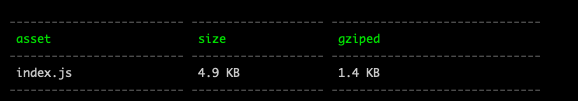

# size-table-webpack-plugin
A webpack plugin to show size and gziped of assets in a table


## How to use

```js
npm i --save-dev size-table-webpack-plugin
```

```js
// webpack.config.js
const SizeTableWebapckPlugin = reuire('size-table-webpack-plugin')

const config = {
  plugins: [
    new SizeTableWebapckPlugin()
  ]
}
```


